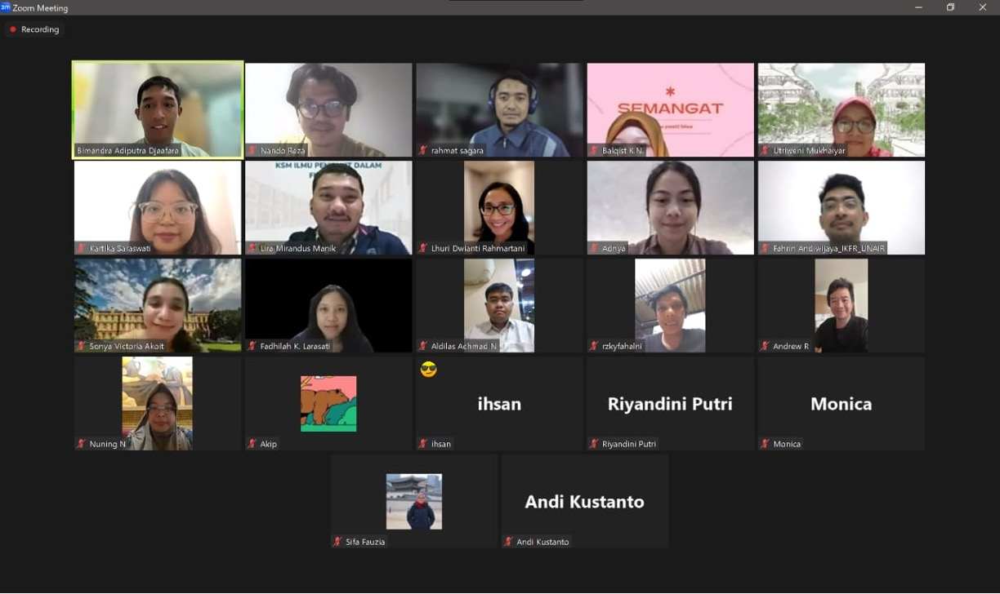

On 2 July 2024, 28 infectious disease modellers from across Indonesia joined our very first community meeting online. It was the moment our community came to life.

Among the highlights of the meeting was a vote on what to call ourselves. The name **INDEMIC** — Indonesia Infectious Disease Modelling Community — was proposed by **Dr Lhuri Rahmartani**, and the community voted to adopt it. The name captures both who we are and what we do: a community rooted in Indonesia, dedicated to infectious disease modelling.

## Photos

```{=html}
<div class="photo-strip">

</div>
```

## Recording

[Watch recording →](https://youtu.be/2szxW7HBSyE){.btn .btn-primary target="_blank"}

## Details

| | |
|---|---|
| **Date** | 2 July 2024 |
| **Format** | Online (Zoom) |
| **Participants** | 28 modellers |
