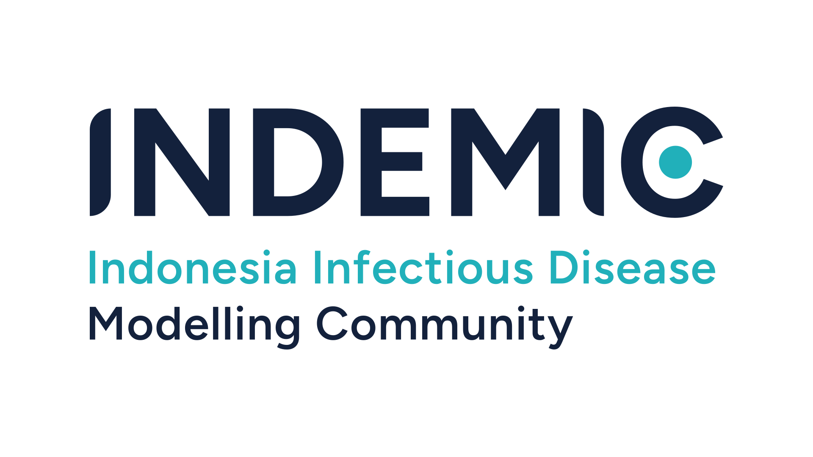

::: {.indemic-hero}
{.hero-logotype alt="INDEMIC — Indonesia Infectious Disease Modelling Community"}

::: {.lead}
A vibrant, collaborative network dedicated to advancing infectious disease modelling in Indonesia — for researchers, early-career scientists, and everyone in between.
:::

[Learn about us →](about.qmd){.btn .btn-primary}
:::

::: {.home-section}

## What we're building

::: {.card-grid}
::: {.home-card}
### Build in-country expertise
We aim to strengthen Indonesia's capacity in infectious disease modelling — connecting people who can learn from each other and apply rigorous modelling to real public health challenges.
:::

::: {.home-card}
### Foster collaboration
We aim to create hands-on opportunities for modellers at every level to connect — through workshops, lectures, research presentations, and symposiums — and to grow together.
:::

::: {.home-card}
### Bridge modellers and decision-makers
We aim to close the gap between the modelling community and policymakers, and make it easier to share opportunities — grants, conferences, collaborations, summer schools — across Indonesia.
:::
:::

:::

::: {.home-section}

## Latest news

::: {#home-news}
:::

[All news →](news/index.qmd){.btn .btn-outline-primary}

:::

::: {.home-contact}
**Questions or want to collaborate?** Reach us at [indemic.community@gmail.com](mailto:indemic.community@gmail.com) or visit our [Events](events.qmd) page to see what's coming up.
:::
