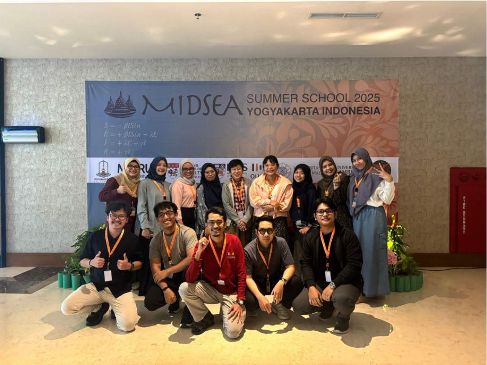
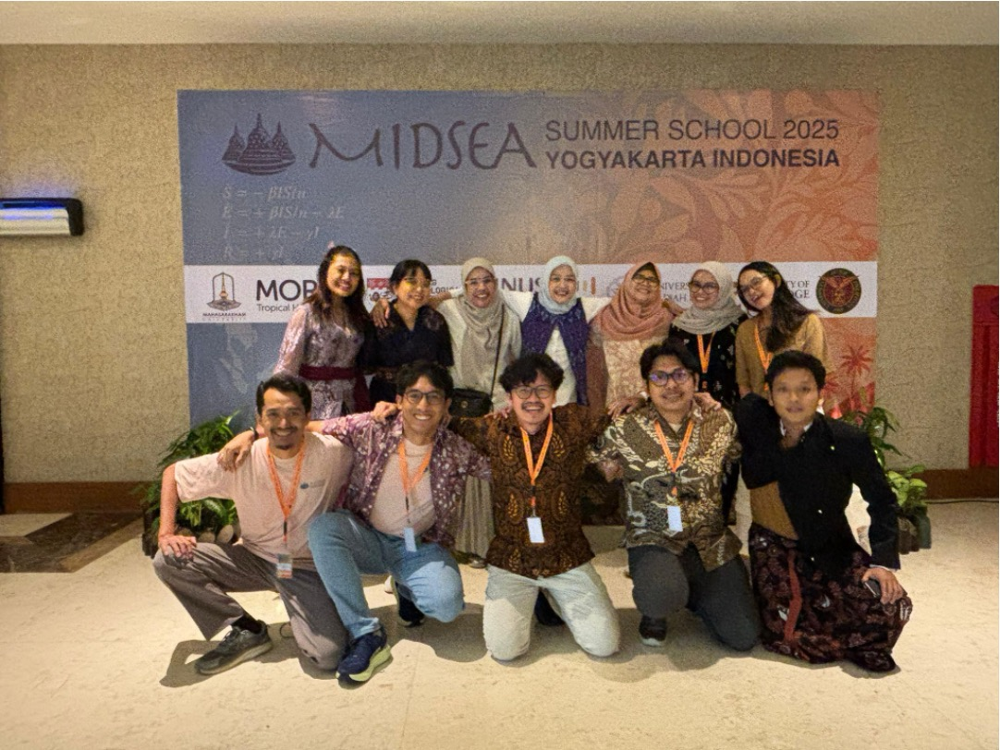

We recently participated in the **MIDSEA Summer School 2025** in Yogyakarta, held 23–29 June at the Department of Mathematics, Universitas Gadjah Mada — marking a special milestone as the first time INDEMIC members gathered together for an offline event. It was incredible to finally meet face-to-face, and we're excited about the possibility of more in-person events in the future!

During the summer school, our members explored different specialised tracks including Modelling 101, Inference, Simulation, and AI. Beyond the technical content, we had the opportunity to connect with fellow modellers from across Southeast Asia and other Asian countries, building valuable networks within our regional research community.

The programme also emphasised professional development through workshops on presentation skills, academic writing, and career guidance — skills that will serve us well in our research journeys.

We're already looking forward to participating in the next MIDSEA Summer School and continuing to grow both as individuals and as a community!

## Photos

```{=html}
<div class="photo-strip">


</div>
```

## Links

- [MIDSEA Summer School 2025](https://midsea-network.github.io/midsea-network/training/2025-midsea-summer-school.html){target="_blank"}
- [Universitas Gadjah Mada — Department of Mathematics](https://matematika.fmipa.ugm.ac.id){target="_blank"}
