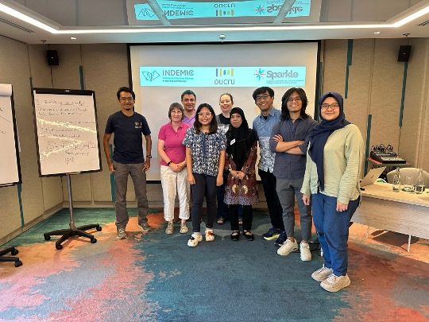
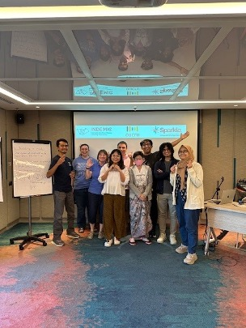

INDEMIC members recently participated in designing a curriculum and training materials for an upcoming modelling workshop in Jayapura, Papua, as part of the [SPARKLE](https://www.spark.edu.au/){target="_blank"} collaboration between OUCRU Indonesia and Australian universities.

The team worked with leading experts to develop comprehensive workshop materials, including **Dr. Trish Campbell** from the University of Melbourne, **Dr. Roslyn Hickson** from James Cook University, and **Dr. Michael Lydeamore** from Monash University Australia.

This collaborative effort represents an important step in strengthening research capacity and knowledge exchange between Indonesian and Australian institutions.

INDEMIC members who participated in the workshop were **Bimandra Djaafara**, **Ihsan Fadilah**, **Kartika Saraswati**, **Tyas Widayati**, **Dewi Anastasia Christina**, **Rahmat Sagara**, and **Hasmi**.

## Training materials

The general SPARKLE Introduction to Mathematical Modelling training materials are freely accessible online:

[Introduction to Mathematical Modelling →](https://training.spark.edu.au/courses/intro-mathematical-modelling/){.btn .btn-primary target="_blank"}

## Photos

```{=html}
<div class="photo-strip">


</div>
```

## Links

- [SPARKLE](https://www.spark.edu.au/){target="_blank"}
- [Introduction to Mathematical Modelling course](https://training.spark.edu.au/courses/intro-mathematical-modelling/){target="_blank"}
