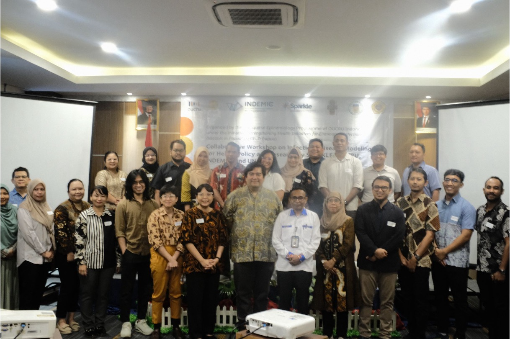
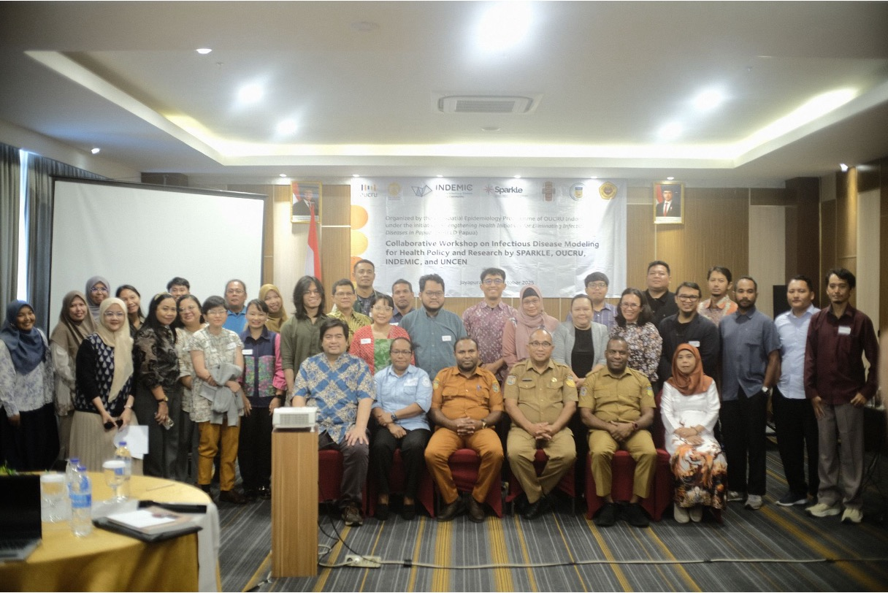

We are delighted to have co-organised a four-day infectious disease modelling workshop in Jayapura, 13–16 October 2025, together with our valued partners: OUCRU Indonesia, SHIELD PAPUA, Universitas Cenderawasih, and the Papua Provincial Health Office, with support from [SPARKLE](https://www.spark.edu.au/){target="_blank"}.

The workshop brought together 15 academics from the Faculty of Mathematics and Natural Sciences, the Faculty of Medicine, and the Faculty of Public Health at Universitas Cenderawasih, as well as policymakers, researchers, and partners from UNICEF Indonesia, PATH, and BRIN. Participants engaged with comprehensive topics including the theory and basics of infectious disease modelling, model fitting, modelling interventions, and vector-borne disease modelling.

A particular highlight was learning firsthand about the challenges in infectious disease control and surveillance in Papua from our colleagues at the Papua Provincial Health Office, as well as discovering how modelling can impact policymaking through insights from speakers from WHO Indonesia, UNICEF Indonesia, and KOBAR Lawan Dengue. Their expertise provided invaluable context for applying modelling techniques to real-world public health scenarios.

We hope this workshop marks the beginning of fruitful future collaborations with our colleagues from Tanah Papua, strengthening research capacity and knowledge exchange in the region.

## Photos

```{=html}
<div class="photo-strip">


</div>
```

## Coverage

- [SPARKLE, OUCRU, INDEMIC dan UNCEN Gelar Lokakarya Kolaboratif Pemodelan Penyakit Menular untuk Riset dan Kebijakan Kesehatan — Universitas Cenderawasih](https://www.uncen.ac.id/sparkle-oucru-indemic-dan-uncen-gelar-lokakarya-kolaboratif-pemodelan-penyakit-menular-untuk-riset-dan-kebijakan-kesehatan/){target="_blank"}
- [Workshop SHIELD Papua Perkuat Kapasitas Riset dan Pemodelan Penyakit Menular — Laboratorium Kesmas Papua](https://labkesmas-papua.go.id/artikel/workshop-shield-papua-perkuat-kapasitas-riset-dan-pemodelan-penyakit-menular){target="_blank"}
