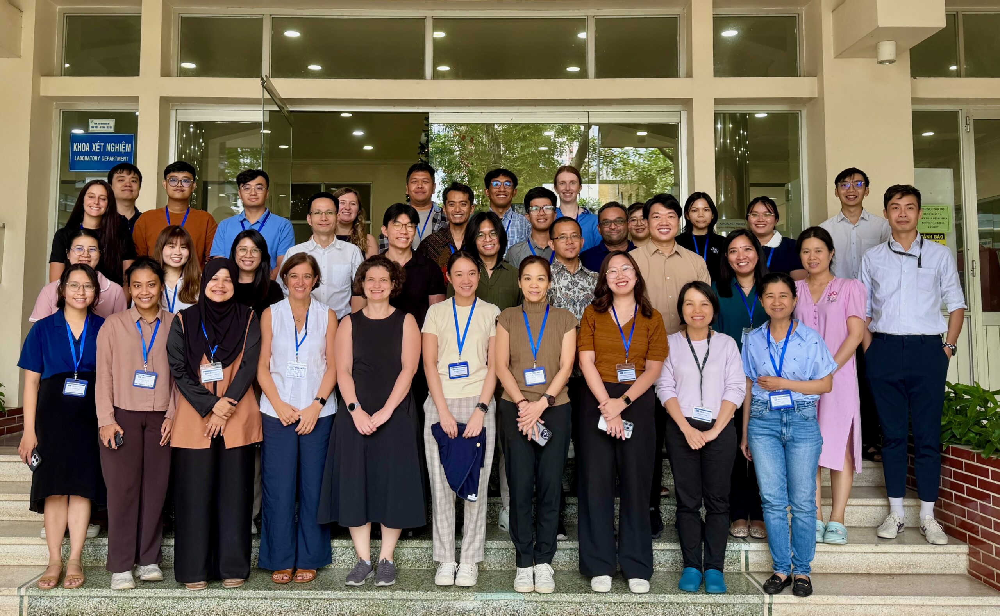
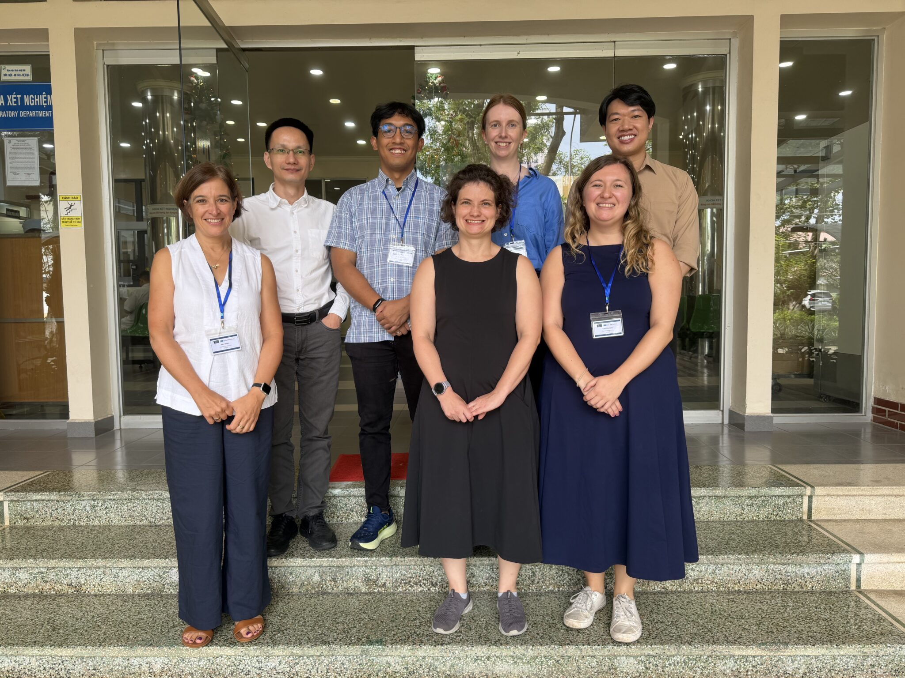

INDEMIC members took part in the **Introductory Short Course on Modelling and Analysis of Serological Data**, a four-day training programme hosted by OUCRU in Ho Chi Minh City, 17–20 November 2025. The course brought together 28 participants from seven Southeast Asian countries, fostering cross-border collaboration on infectious disease modelling.

One of our members, **Bimandra Djaafara** (National University of Singapore), served as a trainer alongside distinguished researchers from Imperial College London's MRC Centre for Global Infectious Disease Analysis (Prof. Azra Ghani, Dr. Clare McCormack, and Dr. Ruth McCabe), A/Prof. Hannah Clapham from NUS, and OUCRU's Mathematical Modelling group (Dr. Marc Choisy and Dr. Thinh Ong).

The curriculum covered foundational modelling concepts, catalytic models, and practical applications using real serological datasets. Learning activities included lectures, paper-based exercises, hands-on computational work using [WODIN](https://mrc-ide.github.io/wodin/){target="_blank"} software, and collaborative group projects culminating in presentations.

## Photos

```{=html}
<div class="photo-strip">


</div>
```

## Links

- [Read the full OUCRU article](https://www.oucru.org/oucru-hosts-introductory-short-course-on-modelling-and-analysis-of-serological-data/){target="_blank"}
