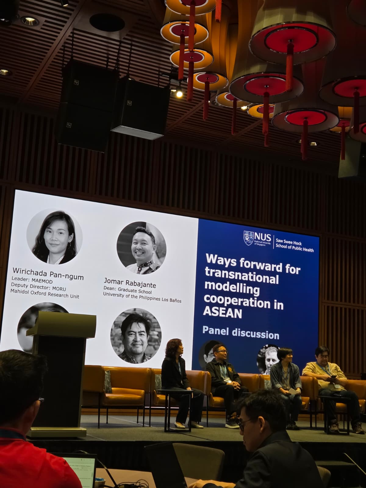
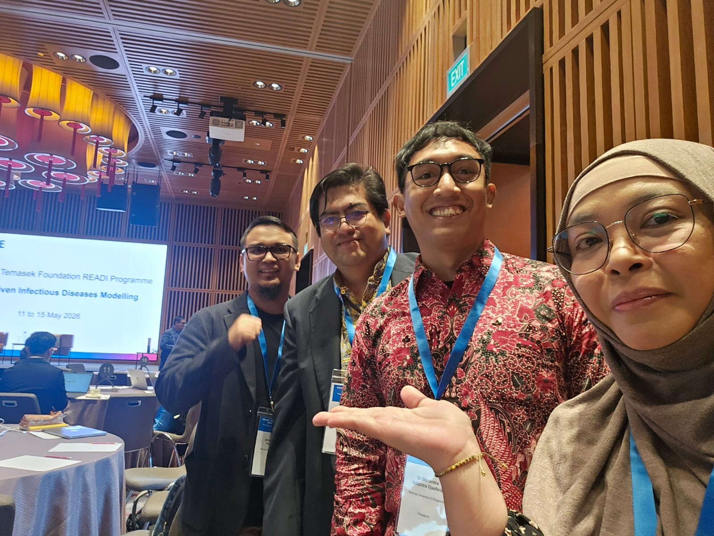
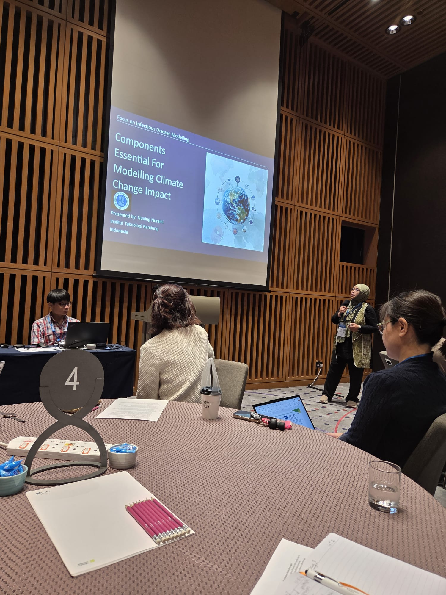
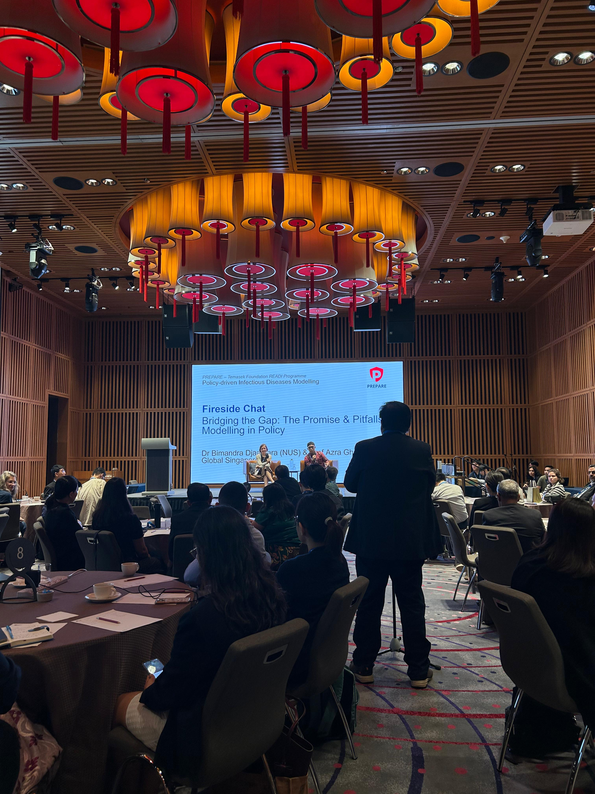
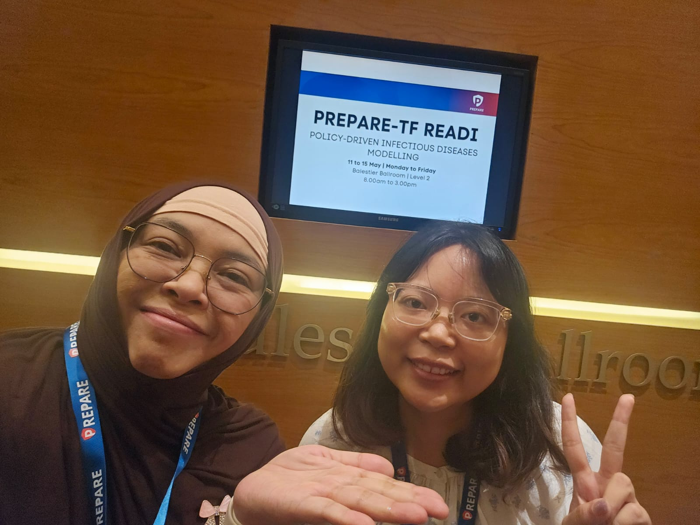

INDEMIC members took part in the **Policy-driven Infectious Diseases Modelling Workshop**, held 11–15 May 2026 in Singapore under the PREPARE–Temasek Foundation Research, Engagements and Alliance for Diseases caused by Infections (READI) programme. The workshop brought together a cross-sectoral ecosystem of academic researchers, operational analysts, and policymakers from across the ASEAN region, co-organised by the Saw Swee Hock School of Public Health and the Centre for Epidemic Research Modelling (CERM) at the National University of Singapore, and the Jameel Institute at Imperial College London.

The workshop centred on three core goals: fostering connections between the academic and policy communities; demonstrating the practical value of infectious disease modelling in policy decisions; and building regional resilience for future epidemics and pandemics.

Several INDEMIC members had active roles throughout the workshop:

- **Bimandra Djaafara** (NUS) chaired the opening Keynote Presentation and Fireside Chat on Day 1, and presented *"Modelling For Policy In Indonesia: Reflections From A Decade Of Work With Indonesia's Health Programme"* in the session on Understanding Each Other: Modellers vs Policymakers.
- **Henry Surendra** (Monash University Indonesia) chaired the same session and presented on optimising disease surveillance data for public health research and policy.
- **Nuning Nuraini** (Institut Teknologi Bandung) presented on the components essential for modelling climate change impact, and on integrating modelling and climate data for public health decision-making.
- **Iqbal Elyazar** participated in the panel discussion on ways forward for transnational infectious disease modelling in ASEAN.
- **Kartika Saraswati** attended the workshop as a participant.

The five-day programme covered a broad range of subthemes including disease surveillance and epidemiology, modelling to inform vaccination policy, the economic and societal impact of infectious diseases, climate and environmental drivers, behaviour and public health, and AI/ML methods for infectious disease modelling and policy-making.

## Photos

```{=html}
<div class="photo-strip">





</div>
```
