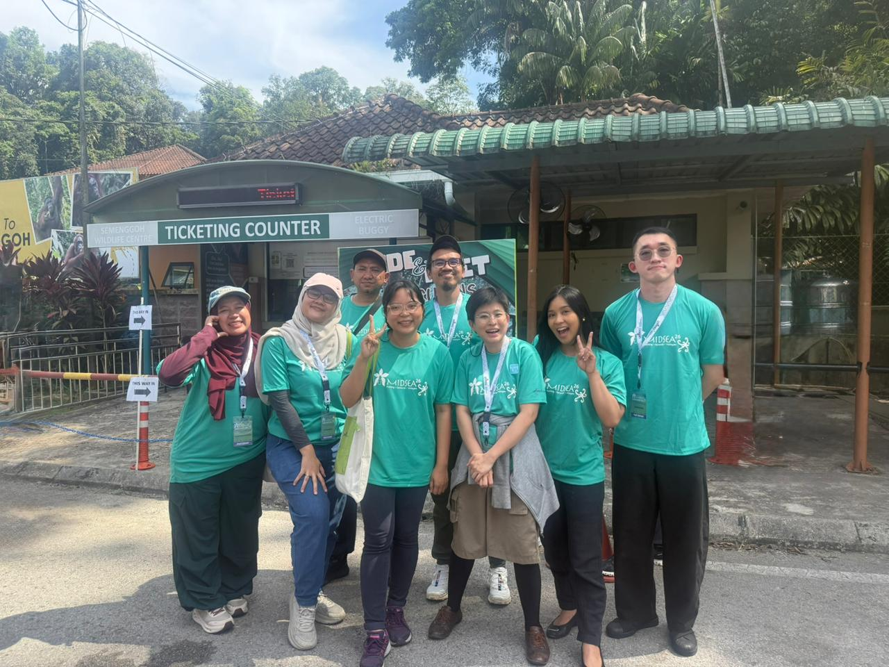

INDEMIC members attended the **MIDSEA Summer School 2026**, held 8–12 June at Universiti Malaysia Sarawak (UNIMAS) in Kuching, Malaysia — the third edition of the annual school, following Quy Nhon, Vietnam (2024) and Yogyakarta, Indonesia (2025), the latter of which was [our first offline gathering as a community](../2025-06-23-midsea-summer-school/index.qmd).

The summer school brought together researchers, academics, public health practitioners, and emerging talents from across Southeast Asia, India, Korea, Japan, and Australia. Organised by UNIMAS's Faculty of Computer Science and Information Technology in collaboration with the [SPARKLE Programme](https://www.spark.edu.au/){target="_blank"} and the Wellcome-funded Dengue Modelling Consortium, the event offered technical training across four parallel tracks: Modelling 101, Simulation, Inference, and Modelling Heterogeneities. Expert instructors came from leading institutions including NUS, Mahidol University, NTU, OUCRU, and Monash University.

<!-- Add which INDEMIC members attended as participants and which as instructors below -->
Our members participated both as **participants** and as **instructors** this year.

Beyond the classroom, participants visited the Semenggoh Wildlife Centre to observe orangutans in their natural habitat — a fitting reminder of the connections between environmental change, wildlife, and infectious disease risk.

The next MIDSEA Summer School is scheduled for 2027 in the Philippines.

## Photos

```{=html}
<div class="photo-strip">

</div>
```

## Coverage

- [MIDSEA Summer School 2026 — MIDSEA Network](https://midsea.network/news/moru-in-the-spotlight-at-midsea-summer-school-2026/){target="_blank"}
- [Empowering Disease Modellers Across Southeast Asia: FCSIT Hosts MIDSEA Summer School 2026 — UNIMAS Gazette](https://gazette.unimas.my/2026/08/10/empowering-disease-modellers-across-southeast-asia-fcsit-hosts-midsea-summer-school-2026/){target="_blank"}
