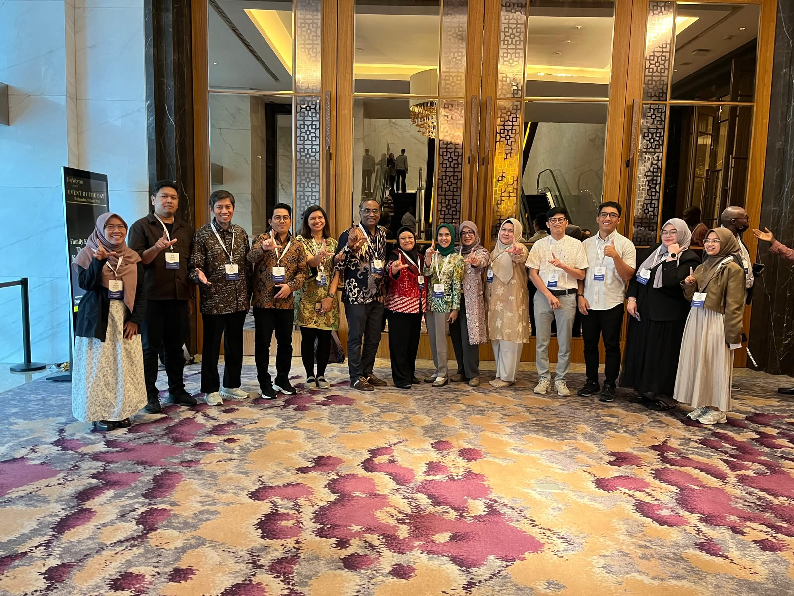
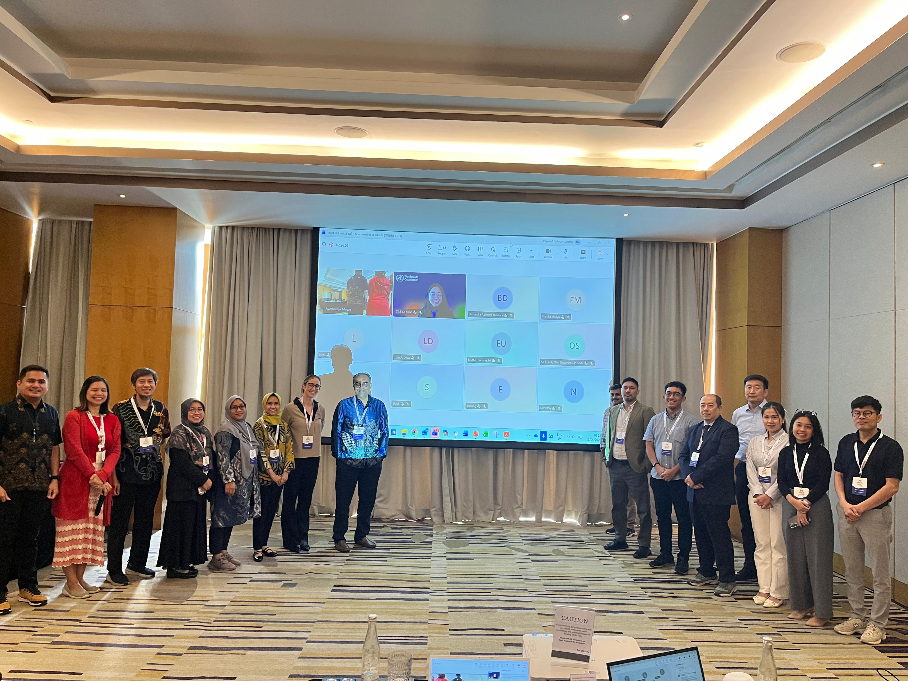
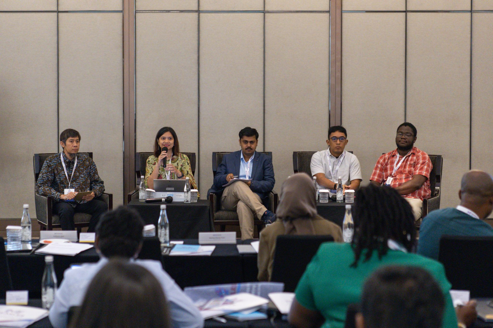
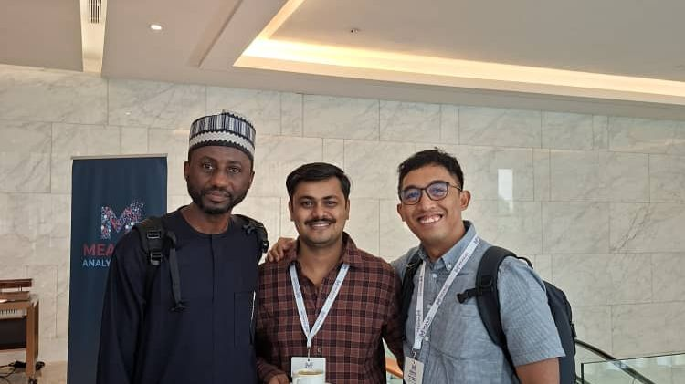

INDEMIC members attended the **2026 Measles Analytics Hub (MAH) Annual Meeting**, held 10–12 June 2026 at The Westin Hotel, Jakarta. The second annual meeting of the MAH convened 76 in-person delegates from 52 institutions, with more than 100 members joining virtually across the three days.

The MAH was established in late 2024 to address fragmentation in the measles modelling landscape and bring together modellers, programme managers, policymakers, and technical partners around evidence-informed decision-making. This year's meeting drew participants from across Africa, Asia, and the Pacific to discuss how modelling and analytics can better support measles and rubella control and elimination.

Sessions spanned five interconnected themes: regional priorities from the Western Pacific, South-East Asia, and African regions; supplementary immunisation activities and novel delivery modalities; surveillance and outbreak detection; translating modelling into decision-support products; and strengthening country-led modelling capacity. A recurring message across all sessions was that modelling is most valuable when it addresses specific programmatic questions, reflects local realities, and is co-developed with the stakeholders who will ultimately use the results.

Recordings from the meeting are available through the MAH quarterly meetings page:

[Watch recordings →](https://www.measles-analytics.org/quarterly-meetings){.btn .btn-primary target="_blank"}

## Photos

```{=html}
<div class="photo-strip">




</div>
```

## Coverage

- [PKKA-PRO FKKMK UGM Berpartisipasi dalam MAH Annual Meeting 2026 di Jakarta — UGM](https://pkka-pro.fkkmk.ugm.ac.id/2026/06/17/pkka-pro-fkkmk-ugm-berpartisipasi-dalam-measles-analytics-hub-mah-annual-meeting-2026-di-jakarta/){target="_blank"}
