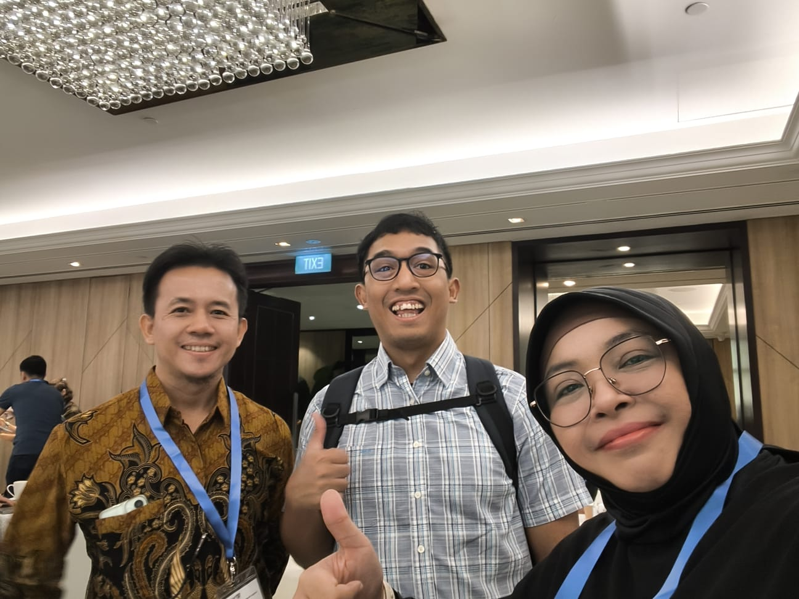
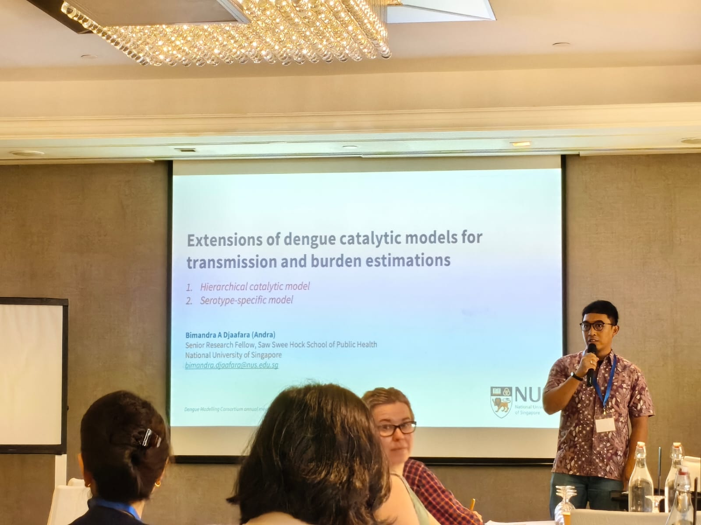

INDEMIC members **Aditya Ramadona**, **Nuning Nuraini**, and **Bimandra Djaafara** attended the **First Annual Meeting of the [Dengue Modelling Consortium](https://cerm.nus.edu.sg/research/dengue-modelling-consortium/){target="_blank"}**, held 18–19 June 2026 at the Saw Swee Hock School of Public Health, National University of Singapore.

The Dengue Modelling Consortium is a five-year international research initiative directed by A/Prof Hannah Clapham from the Centre for Epidemic Research and Modelling (CERM) at NUS, with funding from the Wellcome Trust and the Philanthropy Asia Alliance. The consortium brings together modelling research groups, public health authorities, and international health organisations to improve the evidence base for dengue control through modelling, collaboration, and capacity strengthening — with a particular focus on Southeast Asia and Africa.

The inaugural meeting gathered consortium research teams, members of an international Technical Advisory Group, public health agency representatives, and research collaborators to exchange ideas, strengthen working relationships, and set the consortium's priorities and future direction.

## Photos

```{=html}
<div class="photo-strip">



</div>
```

## Links

- [First Annual Meeting of the Dengue Modelling Consortium — NUS SPH](https://sph.nus.edu.sg/news/first-annual-meeting-of-the-dengue-modelling-consortium/){target="_blank"}
- [Dengue Modelling Consortium — CERM, NUS](https://cerm.nus.edu.sg/research/dengue-modelling-consortium/){target="_blank"}
