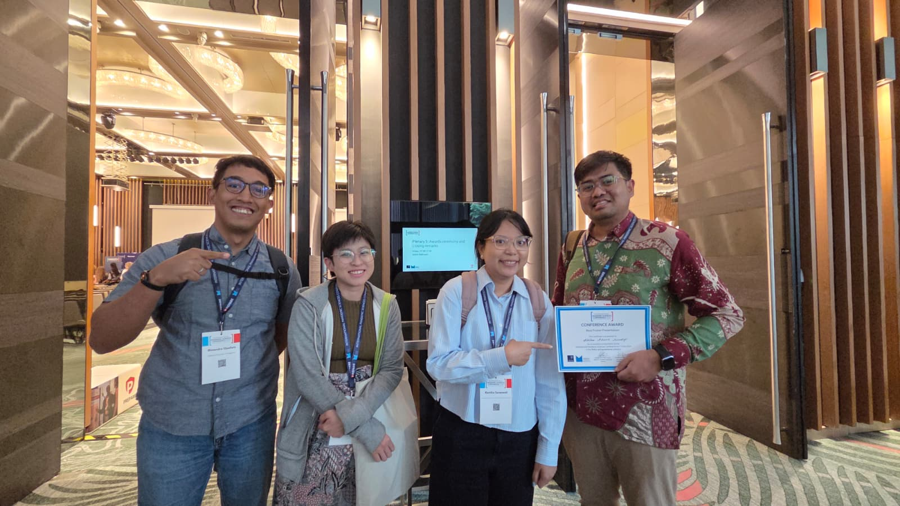
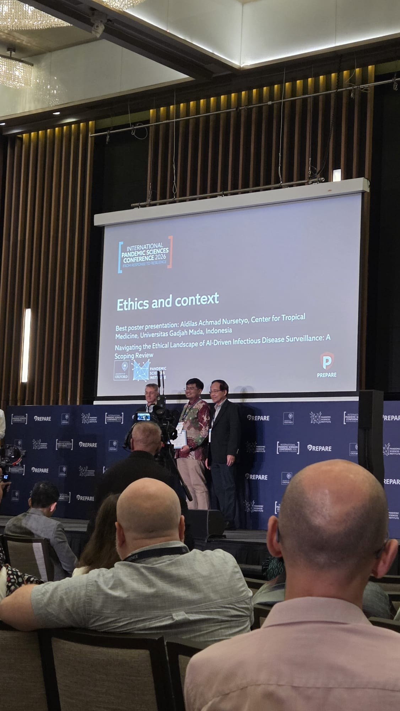

We are delighted to share that INDEMIC member **Aldilas Achmad Nursetyo** received the **Best Poster Presentation Award** in the Ethics and Context theme at the **International Pandemic Sciences Conference 2026: "From Response to Resilience"**, held 1–3 July 2026 at PARKROYAL on Beach Road, Singapore.

The conference, convened by the Pandemic Sciences Institute at the University of Oxford and co-hosted by Singapore's PREPARE programme, is a leading global forum for pandemic sciences research bringing together researchers, policymakers, and practitioners to advance pandemic preparedness. Poster presentations spanned six themes: Ethics and Context, Data Analytics and AI, Vaccines and Immunology, Diagnostics and Treatment, Pathogen Biology and Emerging Threats, and Policy and Governance.

Congratulations, Aldilas!

## Photos

```{=html}
<div class="photo-strip">


</div>
```

## Links

- [International Pandemic Sciences Conference 2026](https://web.cvent.com/event/6ea04566-0f19-4af4-a282-6c0c211e73c0/websitePage:ea6758bc-65eb-4530-8030-0f7a27040cab){target="_blank"}
