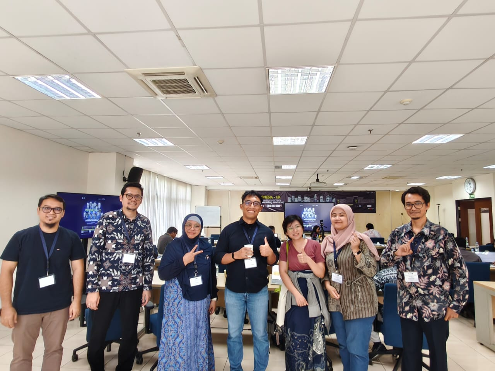
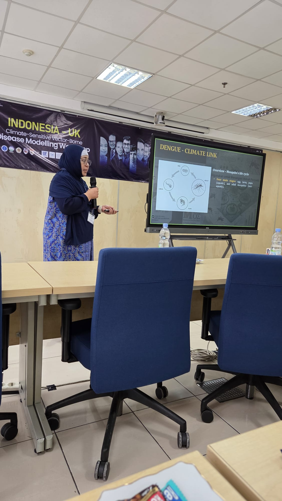
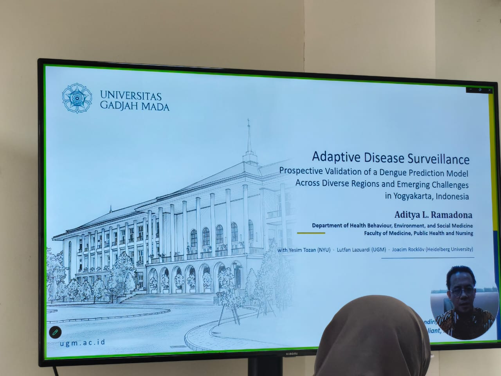
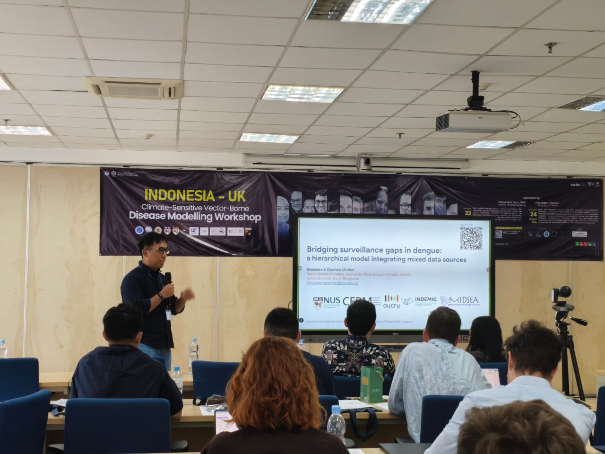
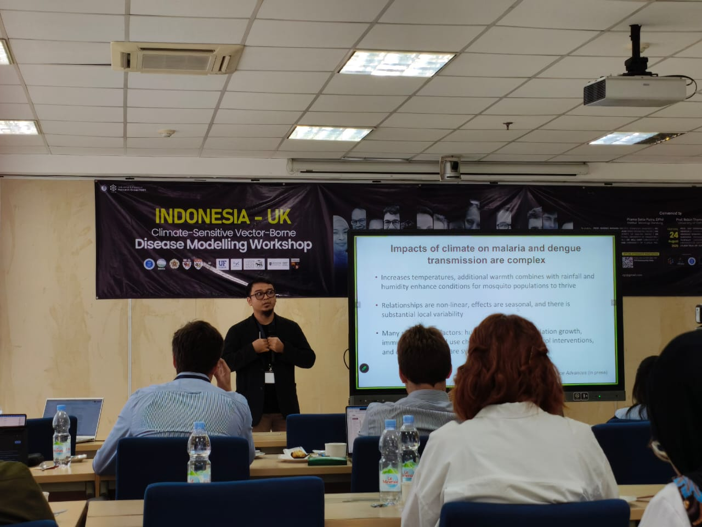
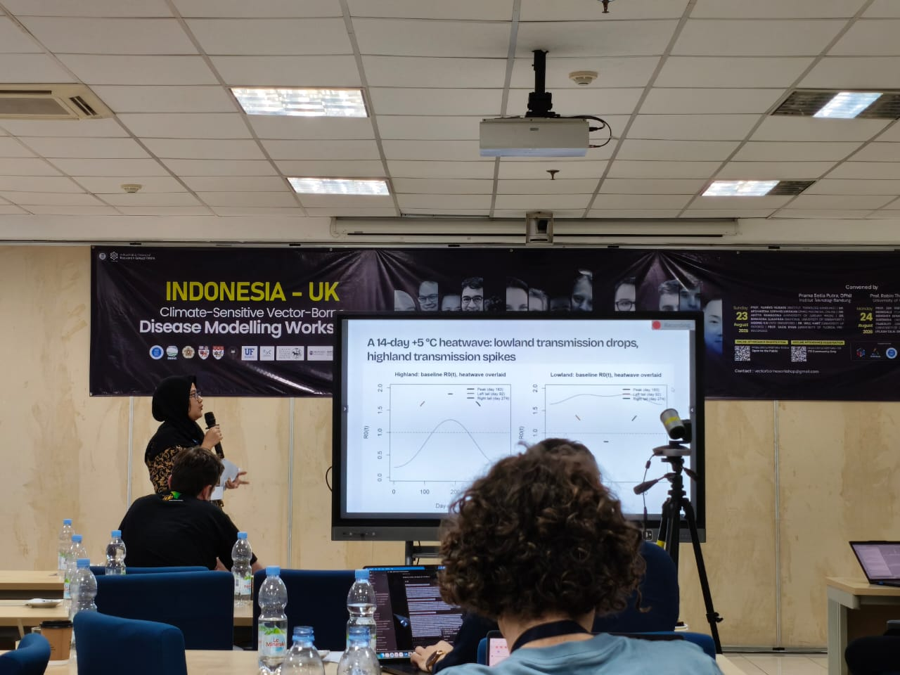

INDEMIC members were centrally involved in this workshop — **Prama Putra** served as head of the organising committee, while **Henry Surendra**, **Nuning Nuraini**, **Bimandra Djaafara**, and **Aditya Ramadona** attended and presented. **Tyas Widayati** and **Rahmat Sagara** also attended as participants.

The workshop is part of the Indonesia–UK Vector-Borne Disease Modelling Network, a collaboration between ITB and the University of Oxford, supported by The Academy of Medical Sciences through the Networking Grants Programme. It brought together scientists from Indonesia, the United Kingdom, and other countries to advance mathematical and computational approaches for understanding vector-borne diseases such as dengue and chikungunya.

Research discussions spanned four key themes: identifying patterns of virus transmission across different regions of Indonesia; investigating the impact of different viral strains on outbreak dynamics; modelling interactions between environmental factors and mosquito population dynamics; and developing early warning systems for forecasting vector-borne disease outbreaks. The workshop also included capacity building and training sessions for early-career researchers and students.

## Photos

```{=html}
<div class="photo-strip">






</div>
```

## Links

- [Indonesia–UK Vector-Borne Disease Modelling Workshop — FMIPA ITB](https://fmipa.itb.ac.id/vectorborneworkshop2026/){target="_blank"}
