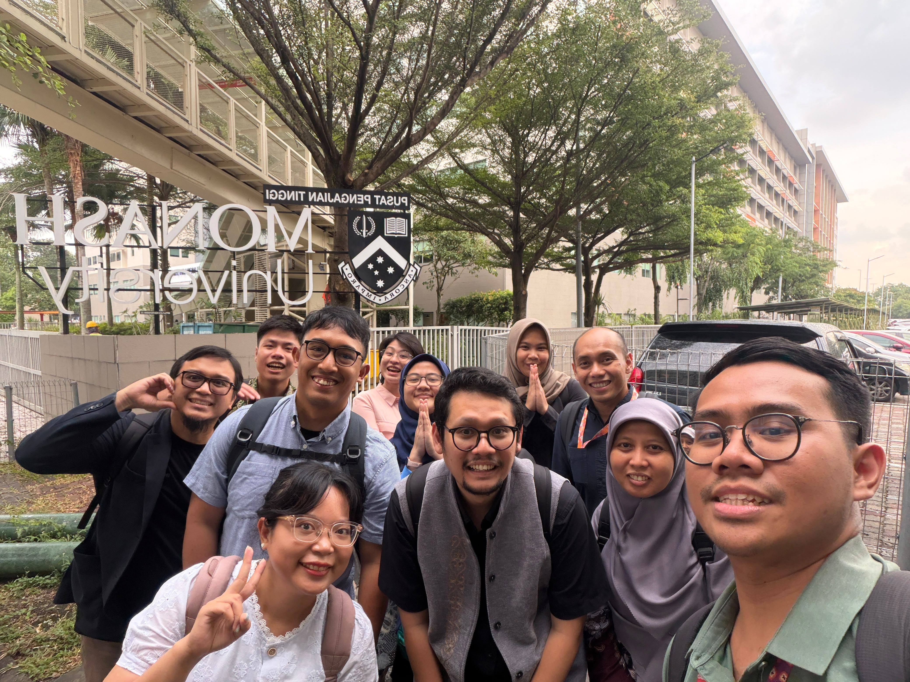
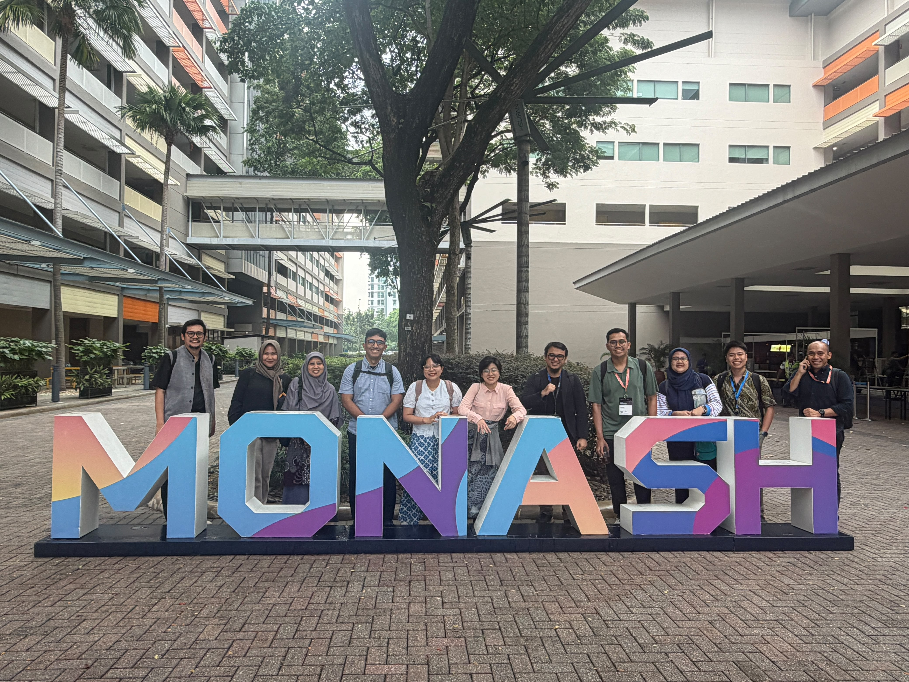
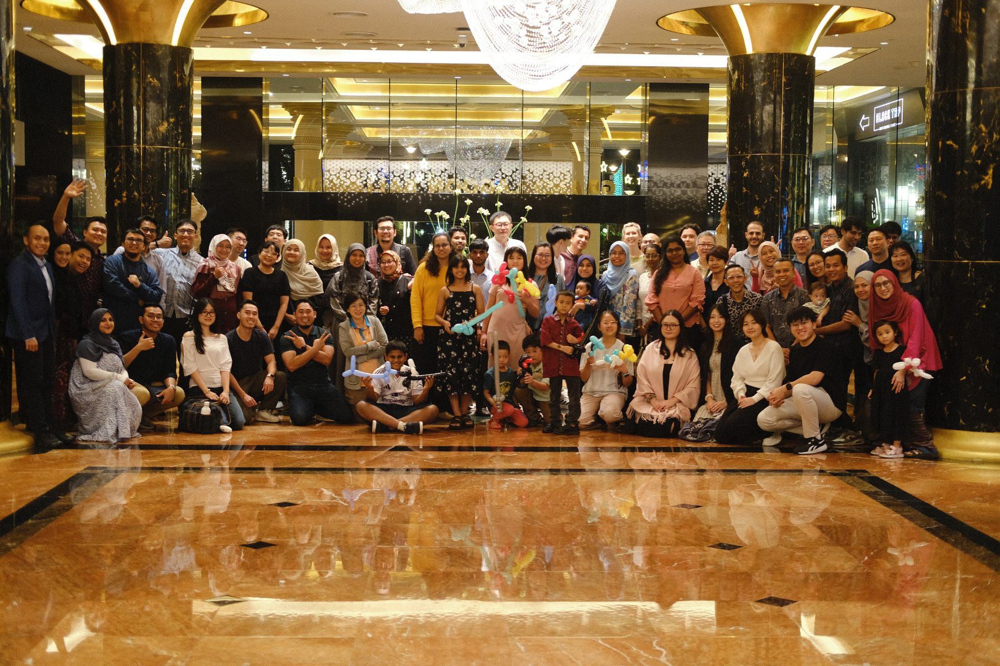
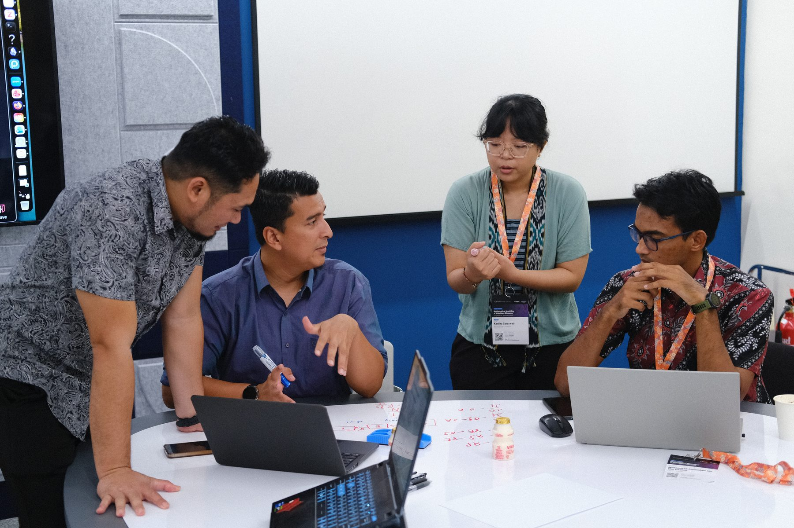
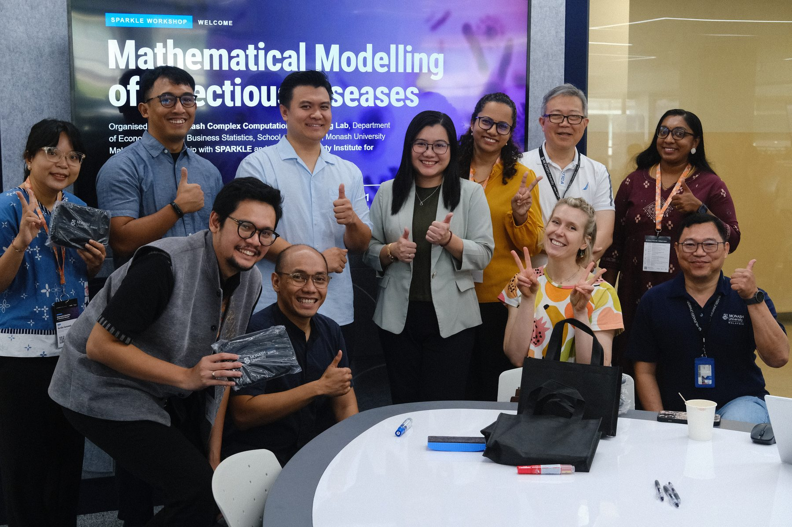
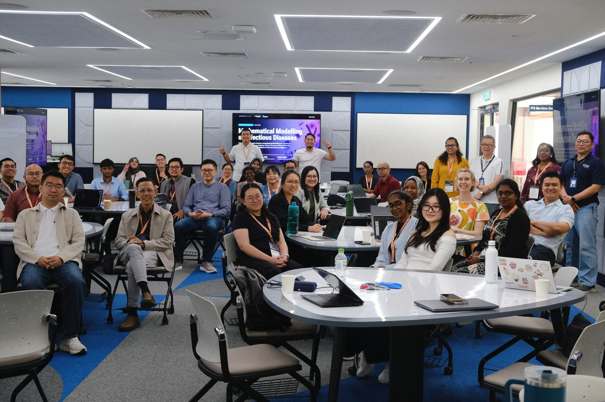
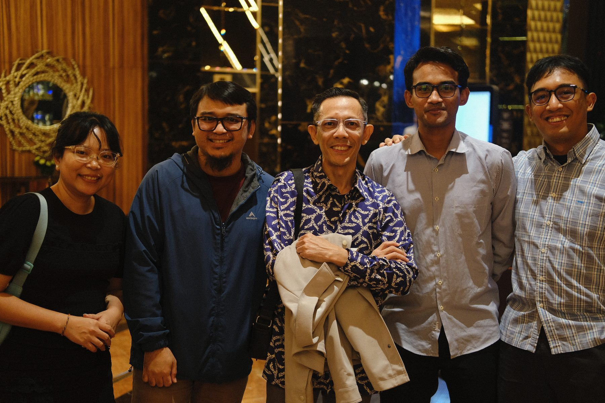

We are proud to share a special milestone for INDEMIC: all seven trainers at the **SPARKLE Workshop 2026: Mathematical Modelling of Infectious Diseases**, held 21–25 September 2026 at Monash University Malaysia in Subang Jaya, were INDEMIC members.

**Bimandra Djaafara**, **Kartika Saraswati**, **Tyas Widayati**, **Dewi Anastasia Christina**, **Cicik Alfiniyah**, **Muhammad Firdaus Kasim**, and **Prama Putra** delivered a five-day hands-on programme covering introduction to mathematical modelling, differential equations in R, model design for pathogens, COVID-19 outbreak case studies, model fitting, vector-borne disease modelling, and intervention modelling.

Among the participants were colleagues from the Infectious and Tropical Diseases Epidemiology research lab at Monash University Indonesia, led by INDEMIC member **Henry Surendra**: **Surya Adhi**, **Richard**, and **Amalia Nurina**.

We are grateful to [SPARKLE](https://www.spark.edu.au/){target="_blank"} and Monash University Malaysia for organising and hosting this event, and for their continued support in building modelling capacity across the region. This workshop is a reflection of how far INDEMIC has come — and a reminder of the community's growing role in regional capacity building.

## Photos

```{=html}
<div class="photo-strip">







</div>
```

## Links

- [SPARKLE Workshop 2026: Mathematical Modelling of Infectious Diseases](https://sparkle.mccml.my/){target="_blank"}
- [SPARKLE Programme](https://www.spark.edu.au/){target="_blank"}
