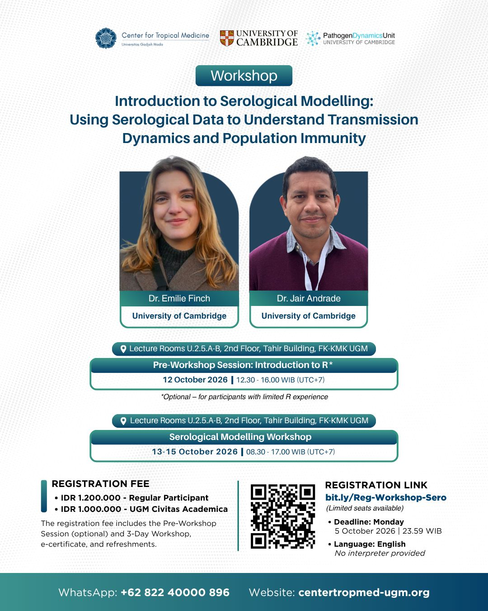

The **Center for Tropical Medicine (CTM), Universitas Gadjah Mada** — home to several INDEMIC members — is hosting the **UGM–Cambridge Serological Modelling Workshop**, a three-day hands-on training on how serological data can be used to understand transmission dynamics and population immunity.

The workshop is led by experts from the **University of Cambridge** and covers key concepts in serological modelling with practical applications. For participants with limited R experience, an optional **Pre-Workshop Session: Introduction to R** is available on 12 October.

## Schedule

| | |
|---|---|
| **12 October** | 12.30–16.00 WIB — Pre-Workshop Session: Introduction to R *(optional)* |
| **13–15 October** | 08.30–17.00 WIB — Three-Day Workshop |

## Details

| | |
|---|---|
| **Venue** | Lecture Rooms U.2.5.A–B, 2nd Floor, Tahir Building, FK-KMK UGM, Yogyakarta |
| **Language** | English (no interpreter provided) |
| **Fee** | IDR 1,200,000 (regular) · IDR 1,000,000 (UGM Civitas Academica) |

## Poster

{style="max-width: 480px; width: 100%; display: block; margin: 1.5rem auto; border-radius: 8px;"}

## Register

[Register here →](https://docs.google.com/forms/d/e/1FAIpQLSdDlTX0CBfqqjToOnIU6BQXtjfCy144eIGSh_t0GQGZBWhClA/viewform){.btn .btn-primary target="_blank"}

## Links

- [LinkedIn announcement — Center for Tropical Medicine UGM](https://www.linkedin.com/posts/workshop-centerfortropicalmedicine-serologicalmodelling-share-7508844934062333952-Ztgc/){target="_blank"}
